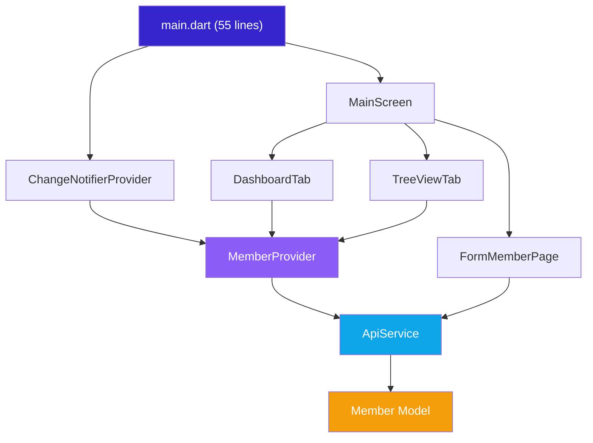

# Walkthrough: Layer-First Architecture Refactoring

## Summary

Refactored a monolithic 998-line [`main.dart`](file:///c:/Users/Alan/DocFlutter/mlm_member/lib/main.dart) into a clean, scalable **Layer-First architecture** with **Provider** for state management, plus premium UI/UX enhancements.

## Architecture



## Files Created / Modified

### Layer 1 — Utils
| File | Lines | Purpose |
|---|---|---|
| [`constants.dart`](file:///c:/Users/Alan/DocFlutter/mlm_member/lib/utils/constants.dart) | 60 | Theme colors, `kAppleShadow`, `AppScrollBehavior`, `kBackgroundGradient`, `getRankColor()` |

### Layer 2 — Models
| File | Lines | Purpose |
|---|---|---|
| [`member.dart`](file:///c:/Users/Alan/DocFlutter/mlm_member/lib/models/member.dart) | 50 | Strictly typed `Member` with `fromJson`/`toJson`, computed `initial` and `uplineDisplay` |

### Layer 3 — Services
| File | Lines | Purpose |
|---|---|---|
| [`api_service.dart`](file:///c:/Users/Alan/DocFlutter/mlm_member/lib/services/api_service.dart) | 43 | `fetchMembers()`, `submitMemberData()` — all HTTP isolated here |

### Layer 4 — State (Provider)
| File | Lines | Purpose |
|---|---|---|
| [`member_provider.dart`](file:///c:/Users/Alan/DocFlutter/mlm_member/lib/providers/member_provider.dart) | 60 | `ChangeNotifier` with `allMembers`, `displayedMembers`, `isLoading`, computed rank counts, `filterSearch()` |

### Layer 5 — Views
| File | Lines | Purpose |
|---|---|---|
| [`main_screen.dart`](file:///c:/Users/Alan/DocFlutter/mlm_member/lib/views/main_screen.dart) | 140 | Frosted AppBar, `BottomNavigationBar`, gradient background |
| [`dashboard_tab.dart`](file:///c:/Users/Alan/DocFlutter/mlm_member/lib/views/widgets/dashboard_tab.dart) | 410 | Search, `AnimatedSize` overview, pull-to-refresh, `_TapScaleWidget` |
| [`tree_view_tab.dart`](file:///c:/Users/Alan/DocFlutter/mlm_member/lib/views/widgets/tree_view_tab.dart) | 160 | `ExpansionTile` tree with connecting lines |
| [`form_member_page.dart`](file:///c:/Users/Alan/DocFlutter/mlm_member/lib/views/form_member_page.dart) | 290 | Add/Edit/Delete form with pill inputs |

### Entry Point
| File | Lines | Purpose |
|---|---|---|
| [`main.dart`](file:///c:/Users/Alan/DocFlutter/mlm_member/lib/main.dart) | **54** ← 998 | `ChangeNotifierProvider` wrapping `MyApp` |

---

## Premium UI Enhancements

| Enhancement | Implementation |
|---|---|
| **Heading Typography** | `GoogleFonts.outfit(fontWeight: w800, letterSpacing: -0.8)` on all section titles — Network Manager, Network Overview, Recent Activity, tree node names, form titles |
| **Body Typography** | `GoogleFonts.plusJakartaSans()` preserved for all body text, labels, badges |
| **Tap Scale Animation** | `_TapScaleWidget` — scales to `0.96` on press (100ms `AnimatedScale`) applied to stat cards and member cards |
| **Gradient Background** | `RadialGradient` with `kPrimary` at 4% opacity positioned at `Alignment.topRight`, enhancing glassmorphism depth |

## Preserved Behaviors

- ✅ Pull-to-refresh on Dashboard (member list) and Network (tree view) tabs
- ✅ `AnimatedSize` slide-up/down toggle for Network Overview section
- ✅ Tree view connecting lines (`Border(left: BorderSide(...))`)
- ✅ Form validation, edit mode, delete mode
- ✅ Navigation return value (`Navigator.pop(context, true)`) triggering data refresh
- ✅ `DevicePreview` wrapper

## Verification

```
flutter analyze --no-pub lib/
→ 0 issues in refactored files
→ 10 info-level warnings in legacy main-old.dart (untouched)
```

> [!TIP]
> You can safely delete [`main-old.dart`](file:///c:/Users/Alan/DocFlutter/mlm_member/lib/main-old.dart) — it's the original monolithic file and is no longer referenced.
